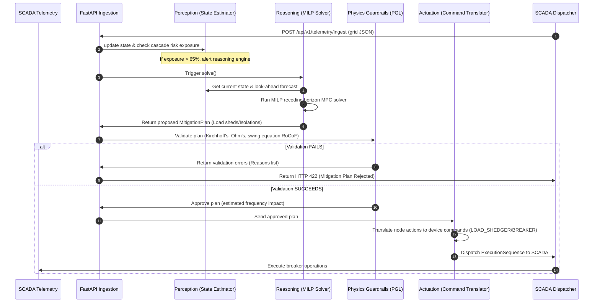
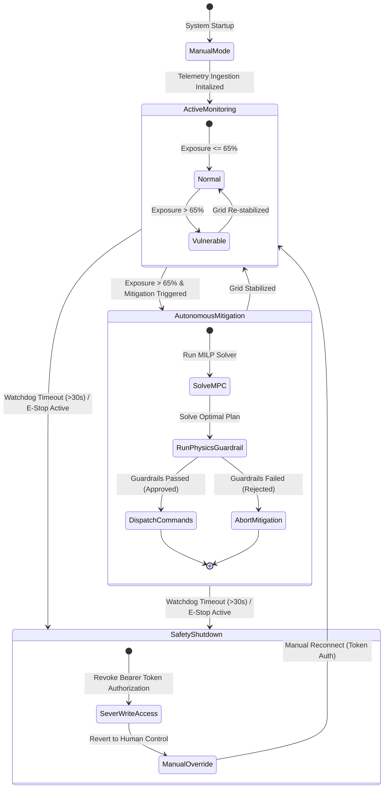

# AuraGrid Automated Load Switching & Node Isolation Core

[](https://fastapi.tiangolo.com)
[](https://www.python.org/)
[](https://opensource.org/licenses/MIT)

AuraGrid is a closed-loop control backend designed for autonomous substation switching and load isolation in electrical distribution networks. It leverages **Model Predictive Control (MPC)** formulated as a **Mixed-Integer Linear Program (MILP)** to mitigate cascading power failures while verifying commands against a deterministic **Physics Guardrail Layer (PGL)**.

---

## ⚠️ Safety Warning: The Physics Guardrail Lock

Under no circumstances should an LLM or Reinforcement Learning (RL) policy issue commands directly to SCADA hardware. AuraGrid enforces a **Zero-Trust Actuation** model: proposed actions are filtered through hardcoded laws of physics (Kirchhoff's Current Law, Ohm's Law thermal capacities, and Swing Equation frequency deviations). Unsafe plans are rejected immediately before SCADA dispatch to prevent hardware damage, substation explosions, or grid-wide blackouts.

---

## 1. System Architecture & Project Flow

AuraGrid is built as a layered, modular control backend. The modules are separated by distinct computational bounds (Perception → Reasoning → Physics Guardrails → Actuation) to enforce safety separation.

### 1.1 Project Directory Structure

```
agent_layer/
├── data/                               # Substation database files by city
│   ├── Bengaluru Electrical Substations.csv
│   └── bhopal_substations.csv etc.
├── src/
│   └── auragrid/
│       ├── main.py                     # FastAPI application entry & lifespans
│       ├── config.py                   # Pydantic-based system configurations
│       ├── auth.py                     # Simple Bearer token security module
│       ├── models/                     # Spec JSON schemas as Pydantic models
│       │   ├── grid_state.py           # Ingest contract (State Space)
│       │   ├── agent_action.py         # Decision schemas (Mitigation Plan)
│       │   └── scada_command.py        # Actuation schemas (Execution Sequence)
│       ├── grid/
│       │   └── topology.py             # CSV Parser & Graph Topology Builder
│       ├── perception/                 # Perception Layer
│       │   ├── state_estimator.py      # Telemetry state tracker
│       │   ├── exposure.py             # Exposure calculation
│       │   └── forecaster_stub.py      # Wavelet forecaster placeholder
│       ├── reasoning/                  # Reasoning Layer
│       │   ├── base_engine.py          # Abstract decision engine interface
│       │   ├── milp_engine.py          # Receding horizon MILP solver (PuLP)
│       │   └── rl_stub_engine.py       # Stub for Reinforcement Learning
│       ├── guardrails/                 # Zero-Trust Physics Guardrails
│       │   ├── physics_guardrail.py    # Kirchhoff's, Ohm's, and Swing Solver
│       │   └── safety_checks.py        # Hospital protection, 30% limit checks
│       ├── actuation/                  # Actuation Layer
│       │   ├── command_translator.py   # High-level actions -> SCADA translator
│       │   └── scada_client_stub.py    # Log/DNP3 client dispatcher mockup
│       ├── failsafe/                   # Fail-Safe Lock Systems
│       │   ├── watchdog.py             # Heartbeat keeper & token revoker
│       │   └── emergency_disconnect.py # Singleton physical E-stop switch
│       └── routes/                     # FastAPI endpoint handlers
└── tests/                              # Pytest test suite (100% test coverage)
```

---

### 1.2 Data and Process Control Flow

The operational flow of the grid control loop is strictly unidirectional, guaranteeing that every command sequence is analyzed by the Physics Guardrail Layer before actuation:



---

### 1.3 State Control Loop Lifecycle

The system runs a deterministic state machine managing agent access and grid safety status:



---

## 2. Mathematical Optimization (MILP MPC)

The decision engine models grid mitigation as a mixed-integer optimization solved over a receding peak forecast horizon:

$$\min_{u, \Delta P} \sum_{k=1}^{H} \left( \sum_{i \in \mathcal{V}} W_{\text{shed}, i} \cdot \Delta P_i(k) + \sum_{e \in \mathcal{E}} W_{\text{switch}, e} \cdot |u_e(k) - u_e(k-1)| \right)$$

### Decision Variables:
- $\Delta P_i(k) \ge 0$: Active load shedded at node $i$ at step $k$ (in MW).
- $u_e(k) \in \{0, 1\}$: Binary state of transmission line $e$ at step $k$ (1 = Closed, 0 = Open/Isolated).
- $s_e(k) \ge 0$: Auxiliary variable linearizing absolute breaker change $|u_e(k) - u_e(k-1)|$.

### Network Constraints:
1. **Kirchhoff's Current Law (KCL):**
   $$\sum_{e \in \text{In}(i)} P_e(k) - \sum_{e \in \text{Out}(i)} P_e(k) + P_{\text{generation}, i}(k) - \left( P_{\text{load}, i}(k) - \Delta P_i(k) \right) = 0, \quad \forall i \in \mathcal{V}$$
2. **Line Thermal Limits (Ohm's Law constraints):**
   $$-u_e(k) \cdot S_e^{\max} \le P_e(k) \le u_e(k) \cdot S_e^{\max}, \quad \forall e \in \mathcal{E}$$
3. **Shed Boundaries:**
   $$0 \le \Delta P_i(k) \le P_{\text{load}, i}(k), \quad \forall i \in \mathcal{V}$$

---

## 3. Physics Guardrail Verification

To guarantee grid safety, plans are validated using the following deterministic checks:
1. **DC Power Flow Simulator:** Calculates power flow $P_{ij} = B_{ij}(\theta_i - \theta_j)$ by solving the nodal injection system $B\theta = P_{\text{inject}}$. Verifies no line exceeds its thermal capacity $S_e^{\max}$.
2. **Dynamic Frequency Deviation ($df/dt$):** Evaluates the Rate of Change of Frequency (RoCoF) using the Swing Equation:
   $$\frac{df}{dt} = \frac{f_0 \cdot \Delta P_{\text{imbalance}}}{2 \cdot H_{\text{sys}} \cdot P_{\text{sys}}}$$
   If $|df/dt| > 0.5$ Hz/s, the action is rejected to prevent triggering Under-Frequency Load Shedding (UFLS) or total grid collapse.
3. **Critical Infrastructure Guard:** Blocks any node isolation or load shedding exceeding 50% on nodes containing hospitals, emergency, or water systems.
4. **Shedding Partition Limit:** Rejects plan if total shedded load exceeds 30% of the active partition load.

---

## 4. API Endpoints

### Ingest SCADA Telemetry
`POST /api/v1/telemetry/ingest`
Accepts 30-second grid state telemetry updates.

### Execute Agent Commands
`POST /api/v1/agent/mitigate`
Accepts a structured command execution sequence. Runs the guardrail check and executes if approved.

### Run Autonomous Optimization
`POST /api/v1/agent/solve?dispatch=false`
Runs the MILP optimization model, passes it through guardrails, and returns the approved mitigation sequence. Set `dispatch=true` to automatically execute.

### Emergency Control
- `POST /api/v1/emergency/disconnect`: Instantly cuts off the agent's write channel.
- `POST /api/v1/emergency/reconnect`: Restores write channel (requires authorization bearer token).

---

## 5. Getting Started

### Prerequisites
- Python 3.11+
- [Cbc Solver](https://github.com/coin-or/Cbc) (automatically bundled with `pulp`)

### Installation
1. Clone the repository:
   ```bash
   git clone https://github.com/mnjay20/agentic_breaker.git
   cd agentic_breaker
   ```
2. Create and activate virtual environment:
   ```bash
   python -m venv .venv
   source .venv/bin/activate  # On Windows: .venv\Scripts\activate
   ```
3. Install development dependencies:
   ```bash
   pip install -e .[dev]
   ```

### Running the API Core
```bash
uvicorn src.auragrid.main:app --reload --port 8000
```
Open [http://localhost:8000/docs](http://localhost:8000/docs) in your browser to view the interactive Swagger API documentation.

### Running Tests
Execute the pytest suite (with coverage metrics):
```bash
pytest tests/ --cov=auragrid -v
```
