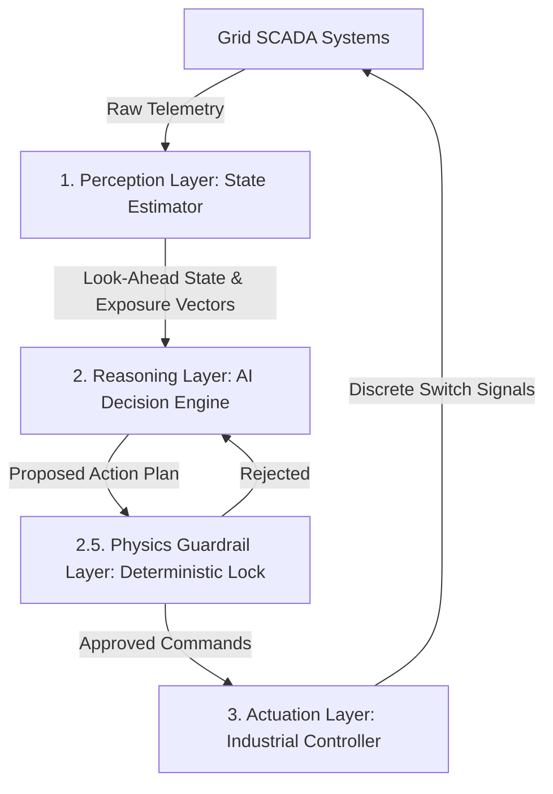

# Autonomous AI Grid Mitigation Agent Specification
**Document ID:** SPEC-AG-001  
**Target Group:** Systems Integration & Control Group  
**System:** AuraGrid Automated Load Switching & Node Isolation Core

---

## 1. Executive Summary & The "Hard Truths" of Grid Automation

Integrating an autonomous AI agent into a high-voltage electrical grid is a high-risk operation. If this agent is coded incorrectly, it will trigger physical explosions at substations, blow transformers, cause city-wide blackouts, or damage heavy municipal infrastructure.

### The Hard Truths:
1. **Zero-Trust AI Actuation:** Under no circumstances should an LLM or unconstrained Reinforcement Learning (RL) policy issue raw commands directly to the SCADA breakers. The agent must be treated as a "suggestion engine" whose outputs are filtered through a deterministic **Physics Guardrail Layer (PGL)** written in hardcoded code (representing Ohm's and Kirchhoff's laws).
2. **The Wear-and-Tear Penalty:** Real grid breakers cannot be switched infinitely. Breakers degrade mechanically. The agent must penalize switching actions; otherwise, it will oscillate switches back and forth trying to optimize 0.5 MW of load, destroying million-dollar hardware.
3. **Frequency Collapse Risk:** Isolating a major node or dropping load instantly changes grid impedance and frequency. The agent must evaluate the dynamic frequency deviation ($df/dt$) before dropping a node to prevent total grid collapse.

---

## 2. Structural Architecture Overview

The system operates as a closed-loop control system divided into three primary layers:



### 1. Perception Layer (State Estimator)
- **Ingestion:** Polls real-time active power ($P_t$), reactive power ($Q_t$), frequency ($f_t$), and breaker states ($B_t$).
- **Forecasting Integration:** Queries the **Neuro-Evolutionary Wavelet Forecaster** to fetch the 12-hour look-ahead vector and the $N \times N$ Cascading Propagation Matrix.
- **Exposure Evaluation:** Calculates the grid exposure coefficient. If exposure exceeds a critical threshold (e.g., cascade probability > 65%), it triggers the Reasoning Layer.

### 2. Reasoning Layer (AI Decision Engine)
- Decides the mitigation action plan (load shedding, load shifting, or node isolation).
- Evaluates the grid state and simulates action outcomes inside a local virtual grid simulator before proposing them to the guardrails.

### 3. Actuation Layer (SCADA Controller)
- Implements secure industrial protocols (DNP3 / IEC 60870-5-104) to write binary switch statuses back to the hardware relays.

---

## 3. Standard Format: Model Predictive Control (MPC) & Linear Programming

In the standard industrial format, the mitigation agent is formulated as a **Constrained Mixed-Integer Linear Program (MILP)** solved over a receding horizon.

### Mathematical Formulation:

$$\min_{u, \Delta P} \sum_{k=1}^{H} \left( \sum_{i \in \mathcal{V}} W_{\text{shed}, i} \cdot \Delta P_i(k) + \sum_{e \in \mathcal{E}} W_{\text{switch}, e} \cdot |u_e(k) - u_e(k-1)| \right)$$

#### Where:
*   $H$: Horizon window (typically 4 hours, matching the peak forecast window).
*   $\mathcal{V}$: Set of all nodes (substations).
*   $\mathcal{E}$: Set of all transmission lines (edges).
*   $\Delta P_i(k)$: Load shedded at node $i$ at time step $k$ (in MW).
*   $u_e(k) \in \{0, 1\}$: Binary state of transmission line $e$ at step $k$ ($1$ = Closed, $0$ = Open/Isolated).
*   $W_{\text{shed}, i}$: High penalty multiplier for shedding load (e.g., $10^5$).
*   $W_{\text{switch}, e}$: Wear-and-tear penalty multiplier for switching a line state (e.g., $10^2$).

#### Constraints:
1.  **Node Power Balance (Kirchhoff's Current Law):**
    $$\sum_{e \in \text{In}(i)} P_e(k) - \sum_{e \in \text{Out}(i)} P_e(k) + P_{\text{generation}, i}(k) - \left( P_{\text{load}, i}(k) - \Delta P_i(k) \right) = 0, \quad \forall i \in \mathcal{V}$$
2.  **Line Thermal Capacity (Ohm's Law constraints):**
    $$-u_e(k) \cdot S_e^{\max} \le P_e(k) \le u_e(k) \cdot S_e^{\max}, \quad \forall e \in \mathcal{E}$$
    *(Ensures if a line breaker is open ($u_e = 0$), power flow $P_e$ is strictly 0. If closed ($u_e = 1$), flow is bounded by thermal limit $S_e^{\max}$.)*
3.  **Shedding Boundaries:**
    $$0 \le \Delta P_i(k) \le P_{\text{load}, i}(k), \quad \forall i \in \mathcal{V}$$

---

## 4. Non-Standard Format: Agentic Reinforcement Learning & LLM Logic

In the non-standard agentic format, a **Deep Reinforcement Learning (DRL) agent** (trained via PPO) or an **Agentic LLM Controller** generates actions in response to JSON state representation.

### State Space JSON Ingest Contract:
The agent receives the following JSON payload representing the grid state every 30 seconds:

```json
{
  "timestamp": "2026-06-06T23:20:00Z",
  "active_city": "BESCOM_Bengaluru_Grid",
  "grid_frequency_hz": 49.98,
  "nodes": {
    "Koramangala Residential": {
      "active_load_mw": 842.0,
      "max_capacity_mw": 1000.0,
      "status": "VULNERABLE",
      "breaker_state": "CLOSED"
    },
    "Electronic City Industrial": {
      "active_load_mw": 1150.0,
      "max_capacity_mw": 1200.0,
      "status": "CRITICAL_CASCADE_RISK",
      "breaker_state": "CLOSED"
    }
  },
  "cascade_risk_matrix": {
    "Electronic City Industrial": {
      "Koramangala Residential": 78.5
    }
  }
}
```

### Action Space Output JSON Schema:
The agent must reply with a structured mitigation command sequence:

```json
{
  "agent_id": "AuraGrid-Mitigator-PPO",
  "actions": [
    {
      "action_type": "SHED_LOAD",
      "target_node": "Electronic City Industrial",
      "parameters": {
        "shed_percentage": 15.0
      }
    },
    {
      "action_type": "ISOLATE_NODE",
      "target_node": "Koramangala Residential",
      "parameters": {
        "reason": "Preventive cascade isolation"
      }
    }
  ]
}
```

### LLM Agent System Prompt Guardrails (Self-Reflection Check):
Before executing, the agent runs a self-verification loop:
```text
State: [Grid State JSON]
Proposed Action: [Action Output JSON]

Verify against safety constraints:
1. Does this action isolate a node containing hospital or emergency services? (If yes, abort).
2. Does the total shedded load exceed 30% of the active partition load? (If yes, abort and query human).
3. Will the action cause thermal limits to be breached on adjacent lines due to redirection?
```

---

## 5. SCADA Actuation API & Integration Contract

The integration team must implement the following REST endpoint on the AuraGrid core backend to allow the agent to issue commands.

### `POST /api/v1/agent/mitigate`

#### Headers:
- `Authorization: Bearer <secure_agent_token>`
- `Content-Type: application/json`

#### Request Payload:
```json
{
  "timestamp_utc": "2026-06-06T23:21:05Z",
  "execution_sequence": [
    {
      "step": 1,
      "device_type": "BREAKER",
      "device_id": "CB_E_CITY_04",
      "target_state": "OPEN",
      "interlock_bypass": false
    },
    {
      "step": 2,
      "device_type": "LOAD_SHEDGER",
      "device_id": "LS_RES_KOR_01",
      "target_state": "ACTIVE",
      "shed_limit_mw": 120.0
    }
  ]
}
```

#### Response (Success):
```json
{
  "status": "COMMANDS_DISPATCHED",
  "transaction_id": "TX_984327984_AG",
  "verification": {
    "interlocks_checked": true,
    "physics_valid": true,
    "estimated_frequency_impact_hz": -0.015
  }
}
```

---

## 6. Fail-Safe and Security Mandates (Critical safety locks)

The engineering team coding this agent must adhere to the following **Fail-Safe Laws**:

1. **The Keep-Alive Ping (Watchdog Timer):** The agent must send a keep-alive heartbeat to the SCADA system every 10 seconds. If the SCADA system does not receive a ping for 30 seconds, it will automatically revoke the agent's write access and revert to human-operator manual mode.
2. **Local Breaker Interlocks:** Breaker mechanisms have physical hardware interlocks (e.g., synchronous check relays). If the agent attempts to close a breaker when the phase angles of the two lines are not synchronized, the local hardware relay **MUST** block the signal, ignoring the agent's command.
3. **Emergency Disconnect Switch:** A physical/software emergency red button must be active in the Web Control Room. Clicking this button immediately cuts off all agent communication channels, isolating the agent from the SCADA layer.
